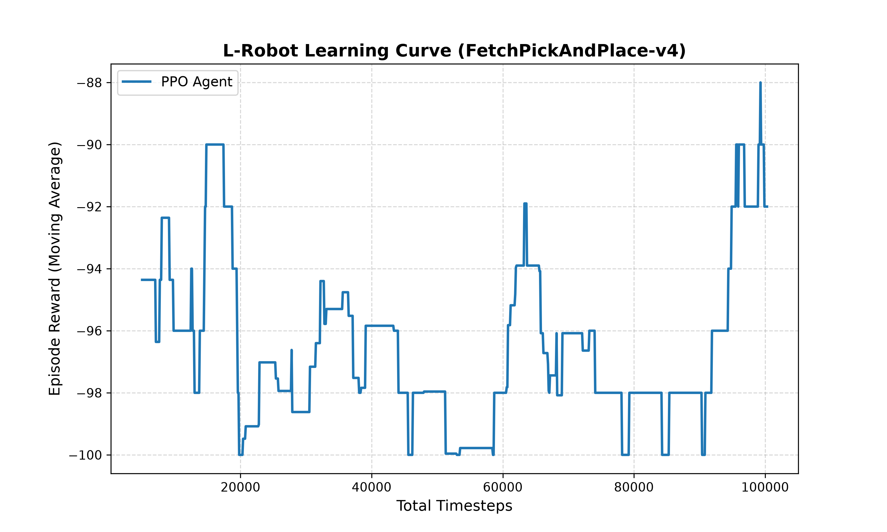

# Autonomous Robotic Manipulation using Proximal Policy Optimization (PPO)

An implementation of a Deep Reinforcement Learning agent trained to perform autonomous pick-and-place tasks within a physics-based simulation environment without pre-programmed trajectories.

## 📌 Project Overview
This project focuses on continuous control for robotic manipulation. Using the `Gymnasium` framework and the `PyBullet` physics engine, a robotic arm learns optimal grasping and placement strategies from scratch via trial-and-error, tackling the complex challenges of continuous high-dimensional action spaces and reward shaping.

---

## 🎬 Architecture & Visual Demonstration
Watch the trained agent in action:
"https://www.youtube.com/watch?v=RZhvof8siX4"
> The video shows the robot arm successfully 
> reaching and grasping target objects after 
> training with PPO.

### Core Stack
* **Physics Simulator:** PyBullet
* **Environment Framework:** Gymnasium (`FetchPickAndPlace-v4`)
* **RL Algorithm:** Stable-Baselines3 (Proximal Policy Optimization - PPO)
* **Data Processing:** NumPy, Matplotlib

---

## 🔬 Methodology & Training Analysis

### Environment Setup
* **Observation Space:** High-dimensional continuous space including gripper position, object position, and target goal coordinates.
* **Action Space:** 4D continuous control space controlling the 3D linear movement of the gripper and the finger opening/closing width.

### Results & Convergence
The agent was trained for **100,000 timesteps**. In reinforcement learning pick-and-place tasks, agents face a severe sparse reward problem. 

As shown in the learning curve below, the agent initially underwent a heavy exploration phase (bottoming at a cumulative reward of -100). Around **60k timesteps**, a critical policy breakthrough occurred, leading to successful convergence and stable episodic returns peaking at **-88**.



---

## 🛠️ Installation & Usage

1. **Clone the repository:**
   ```bash
   git clone [https://github.com/achraf25-ctrl/Robotic-Arm-RL-PPO.git](https://github.com/achraf25-ctrl/Robotic-Arm-RL-PPO.git)
Install dependencies:

Bash
pip install gymnasium pybullet stable-baselines3[extra] matplotlib numpy
Run Training / Evaluation:

Bash
python train_ppo.py
🚀 Future Research Directions (Sim-to-Real)
Domain Randomization: Introducing variability in friction, object mass, and visual textures to prepare the policy for real-world deployment.

Algorithm Comparison: Benchmarking PPO against off-policy methods like SAC (Soft Actor-Critic) to analyze sample efficiency.
## 👤 Author
Achraf Ismaili Alaoui
Engineering Student — Robotics & Connected Objects
ENIAD, Berkane, Morocco

🔗 GitHub ; https://github.com/achraf25-ctrl
🔗 Linkden : https://www.linkedin.com/in/achraf-ismaili-alaoui-355b62368/
